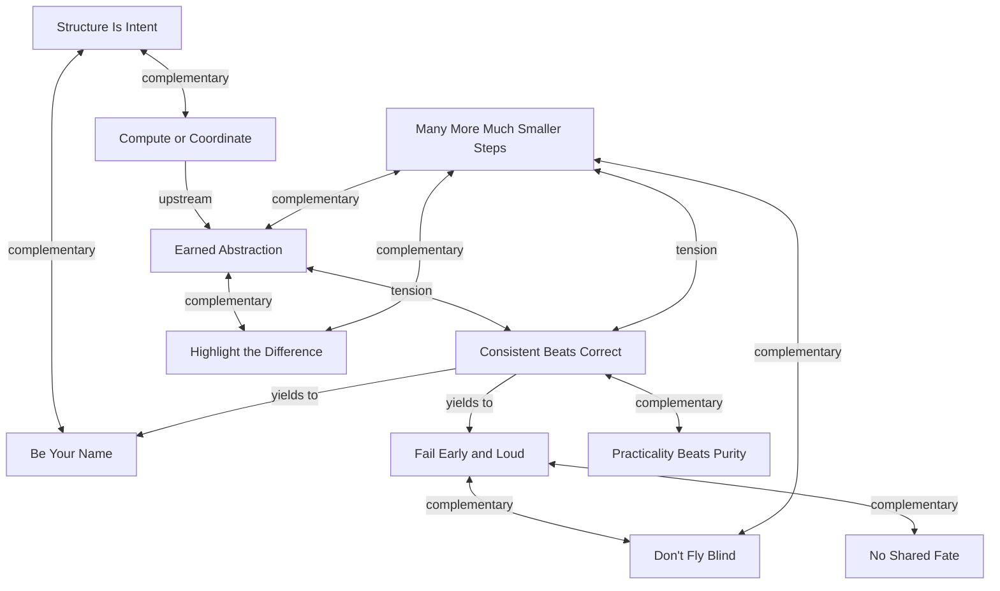

# Principle Relationships

How principles connect to each other and where they sit in the design
landscape. This is a derived view — the cross-references in each principle
file are authoritative. This document provides the overview.

## Relationship graph



## Architectural and delivery families

Principles cluster into two families with a fuzzy border. Placement is
approximate — the cross-references are authoritative, not this diagram.

```
        ARCHITECTURAL                 DELIVERY
 ┌─────────────────────────┰─────────────────────────────┐
 │                         ┃                             │
 │  SII  ·  CoC  ·  NSF    ┃   MMMSS  ·  DFB  ·  PBP     │
 │                         ┃                             │
 │              BYN ·······╂······ HTD                   │
 │                    EA ··╂·· CBC                       │
 │                       FEAL                            │
 │                         ┃                             │
 └─────────────────────────┸─────────────────────────────┘
```

**Architectural** principles govern how things fit together — structure,
boundaries, naming, classification, isolation. An architect reaches for these
when deciding what to build and how the pieces relate.

**Delivery** principles govern how we build and ship — sequencing, observability,
patterns, and when to break rules. A delivery planner reaches for these when
deciding how to get from the design to working software.

Some principles straddle the border:
- **BYN** leans architectural — naming is a design decision — but names are
  also refined during implementation.
- **HTD** leans delivery — differences matter most during change and review —
  but extraction patterns are also a structural concern.
- **EA** and **CBC** sit in the overlap — EA governs both what to abstract
  (design) and when (timing/delivery); CBC governs patterns that are
  established during design but enforced during delivery.
- **FEAL** spans both — code-level error handling is architectural, but
  boundary validation is a delivery concern.

## Common entry points

These are not a prescribed ordering — context determines which principle is
primary. But when starting work in each family, these are common first
questions:

**Architecture work** (what are the big pieces, how do they communicate):
- Start with **SII** and **CoC** — lay out domains, classify code roles.
- **NSF** follows naturally — verify boundaries don't share fate.
- **BYN** and **EA** refine — name things by role, resist premature abstraction.

**Delivery work** (how to sequence, validate, ship):
- Start with **MMMSS** — break work into small, reversible steps.
- **DFB** pairs immediately — each step needs signals before shipping.
- **HTD** and **CBC** refine — make differences visible, follow established patterns.

**PBP** is the escape valve for both families — invoke only when genuine
conflict arises, never as a shortcut.
