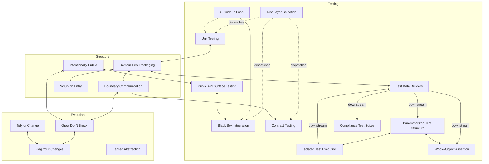

# Strategy Relationships

How strategies connect to each other and where they sit in the design
landscape. This is a derived view — the cross-references in each strategy
file are authoritative. This document provides the overview.

## Relationship graph

Composition chains and cross-family bridges. Dotted lines are meta-strategy
dispatch; solid lines are composition or mutual reference. Not every
cross-reference appears — individual files are authoritative.



## Strategy families

Strategies cluster into three families. Placement is approximate — the
cross-references are authoritative, not this diagram.

```
    STRUCTURE              TESTING                  EVOLUTION
┌────────────────┰──────────────────────────┰──────────────────┐
│                ┃                          ┃                  │
│  DFP  ·  IP    ┃  TLS  ·  UT  ·  BBIB     ┃  GDB  ·  FYC     │
│                ┃  OILD  ·  CT             ┃  ToC             │
│  SOE           ┃  ITE  ·  TDB  ·  PAST    ┃                  │
│                ┃  PTS  ·  WOA  ·  CTS     ┃                  │
│                ┃                          ┃                  │
│           BC ··╂··························╂·· EA             │
│                ┃                          ┃                  │
└────────────────┸──────────────────────────┸──────────────────┘
```

**Structure** — how code is organized: domains, boundaries, visibility,
validation.

**Testing** — how code is verified: test layer selection, case structure,
data builders, assertions.

**Evolution** — how code changes safely: separating cleanup from behavior,
progressive rollout, earned abstraction.

Two strategies straddle families:
- **BC** defines boundary contracts (structure) but is heavily referenced by
  evolution strategies (GDB, FYC) because contracts must evolve safely.
- **EA** governs when to abstract (evolution) but testing strategies (UT,
  TDB) use it as a decision criterion for test helper extraction.

## Common entry points

Context determines which strategy is primary. These are common starting
points per family:

**Structure work** (where do things live, how do they communicate):
- Start with **DFP** — organize code by domain.
- **IP** follows — decide what's public.
- **BC** follows — define how boundaries talk.
- **SOE** refines — validate at the boundaries DFP establishes.

**Testing work** (what to test, how to test it):
- Start with **TLS** — classify what you're verifying to pick the right layer.
- **OILD** sequences the work — coordinator first, then computation, then integration.
- **UT**, **BBIB**, or **CT** follow from the classification.
- **ITE** + **TDB** for test infrastructure; **PTS** + **WOA** for test structure.

**Evolution work** (how to ship change safely):
- Start with **ToC** — separate tidying from behavior change.
- **FYC** for progressive rollout of new behavior.
- **GDB** for backward-compatible boundary evolution.
- **EA** as a check — is abstraction earned or premature?
